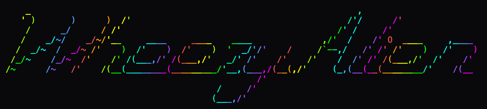

<head>
<link rel="preconnect" href="https://fonts.googleapis.com">
<link rel="preconnect" href="https://fonts.gstatic.com" crossorigin>
<link href="https://fonts.googleapis.com/css2?family=Permanent+Marker&display=swap" rel="stylesheet">
</head>

<h1 style="font-family: 'Permanent Marker'; text-align: center"> IT Technician | Hobbyist | Procrastinator </h1>

### I'm a hobbyist developer, sticking to the administration side of technology professionally.

### I've got experience managing macOS and Windows, as well as running various homelab softwares in my spare time.

Some of my experience:  
    
  </a>

<a href='https://github.com/marketplace/actions/quote-readme'>
<!--STARTS_HERE_QUOTE_README-->
<!--ENDS_HERE_QUOTE_README-->
</a>
